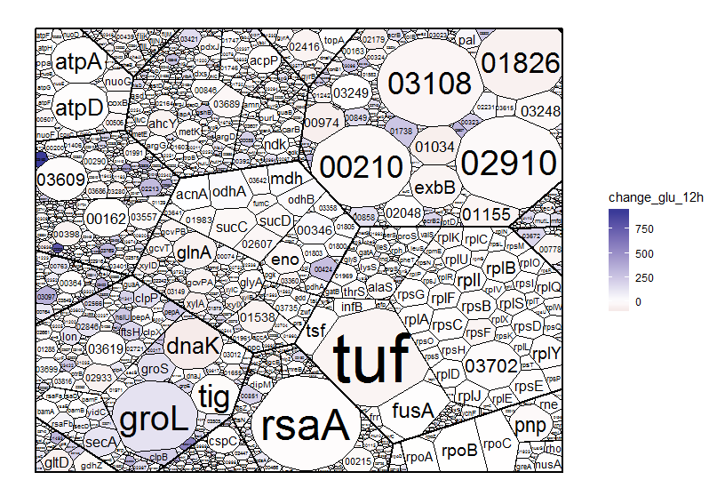

# Voronoi treemaps in R

Voronoi treemaps in R using [Voronoi-Treemap-Library](https://github.com/ArlindNocaj/Voronoi-Treemap-Library) and rJava

## Example output


Install prerequisites:
For debian/ubuntu:
```
$ sudo apt install r-cran-rjava gradle
```
Then, in R:
```
>install.packages(c("dplyr", "tibble", "data.tree", "stringr"))
```

Before running, you need to build the java library:
```
$ git clone --recursive https://github.com/dlesl/voronoi_treemap
$ cd voronoi_treemap/Voronoi-Treemap-Library
$ gradle build
```

The proteomics sample data comes from [Schramm et al., 2017](https://journals.plos.org/plosgenetics/article?id=10.1371/journal.pgen.1007148),
and [Jahn et al., 2018](https://www.cell.com/cell-reports/pdf/S2211-1247(18)31485-2.pdf).

See also https://github.com/m-jahn/SysbioTreemaps for an
implementation using additively-weighted Voronoi diagrams.